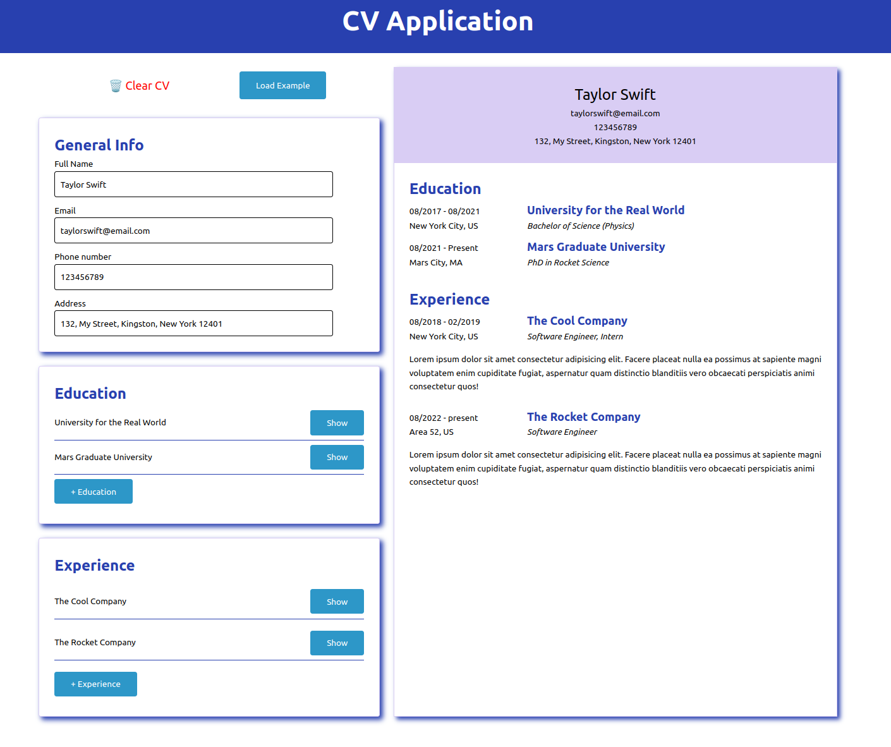

# cv-application

Project Overview: CV Generator with React

This project was undertaken as part of The Odin Project's JavaScript curriculum, focusing on building a dynamic CV generator using React. The primary objective was to create a seamless user experience with two main sections: the input and preview segments.

Real-time preview: Users can input, edit, and delete their CV information in the input section, witnessing instant updates in the preview section.

🚀 Demo

Explore the live demo of the project: https://cv-generator-nq4p.onrender.com/

🧐 Project Highlights:

Technology Stack:

- The project is built using React, ensuring a responsive and efficient user interface.
- Type writing with Typescript

🖼 Project Screenshot:

